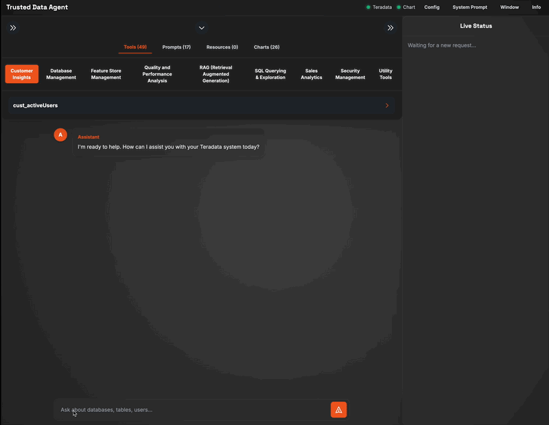

# Trusted Data Agent for Teradata

**An Advanced, Dynamic AI Conversational Interface for Enterprise Data Platforms.**

The Trusted Data Agent represents a paradigm shift in how developers, analysts, and architects interact with complex data ecosystems. It is a sophisticated web application designed not only to showcase AI-powered interaction with a Teradata database but to serve as a powerful, fully transparent "study buddy" for mastering the integration of Large Language Models (LLMs) with enterprise data.

This solution provides unparalleled, real-time insight into the complete conversational flow between the user, the AI agent, the Teradata **Model Context Protocol (MCP)** server, and the underlying database, establishing a new standard for clarity and control in AI-driven data analytics.





---

## Table of Contents
- [Overview: A Superior Approach](#overview-a-superior-approach)
- [How It Works: Architecture](#how-it-works-architecture)
- [Key Features](#key-features)
- [Installation and Setup Guide](#installation-and-setup-guide)
  - [Prerequisites](#prerequisites)
  - [Step 1: Clone the Repository](#step-1-clone-the-repository)
  - [Step 2: Set Up Dependencies](#step-2-set-up-dependencies)
  - [Step 3: Configure API Key (Optional)](#step-3-configure-api-key-optional)
- [Running the Application](#running-the-application)
  - [Standard Mode](#standard-mode)
  - [Developer Mode: Unlocking Models](#developer-mode-unlocking-models)
  - [Developer Mode: Enabling Charting](#developer-mode-enabling-charting)
- [User Guide](#user-guide)
  - [First-Time Setup: Connecting to Services](#first-time-setup-connecting-to-services)
  - [Navigating the Interface](#navigating-the-interface)
  - [Mastering the System Prompt Editor](#mastering-the-system-prompt-editor)
  - [Starting a Conversation](#starting-a-conversation)
- [Troubleshooting](#troubleshooting)
- [Author & Contributions](#author--contributions)

---

## Overview: A Superior Approach

The Trusted Data Agent transcends typical data chat applications by placing ultimate control and understanding in the hands of the user. It provides a seamless natural language interface to your Teradata system, empowering you to ask complex questions and receive synthesized, accurate answers without writing a single line of SQL.

Its core superiority lies in its **unmatched transparency and dynamic configurability**:

1.  **Deep Insight:** The **Live Status** panel is more than a log; it's a real-time window into the AI's mind, revealing its reasoning, tool selection, and the raw data it receives. This makes it an indispensable tool for debugging, learning, and building trust in AI systems.
2.  **Unprecedented Flexibility:** Unlike static applications, the Trusted Data Agent allows you to dynamically configure your LLM provider, select specific models, and even edit the core **System Prompt** that dictates the agent's behavior—all from within the UI.

This combination of power and transparency makes it the definitive tool for anyone serious about developing or deploying enterprise-grade AI data agents.

## How It Works: Architecture

The application operates on a sophisticated client-server model, ensuring a clean separation of concerns and robust performance.

```
+-----------+      +-------------------------+      +------------------+      +----------------------+      +------------------+
|           |      |                         |      |                  |      |                      |      |                  |
| End User  | <--> |  Frontend (index.html)  | <--> | Backend (Python) | <--> | Large Language Model | <--> | Teradata MCP     |
|           |      |     (HTML, JS, CSS)     |      |   (Quart Server) |      |  (Reasoning Engine)  |      | Server (Tools)   |
|           |      |                         |      |                  |      |                      |      |                  |
+-----------+      +-------------------------+      +------------------+      +----------------------+      +------------------+
```

1.  **Frontend (`index.html`):** A sleek, single-page application built with HTML, Tailwind CSS, and vanilla JavaScript. It captures user input and uses Server-Sent Events (SSE) to render real-time updates from the backend.
2.  **Backend (`mcp_web_client.py`):** A high-performance asynchronous web server built with **Quart**. It serves the frontend, manages user sessions, and orchestrates the entire AI workflow.
3.  **Large Language Model (LLM):** The reasoning engine. The backend dynamically initializes the connection to the selected LLM provider (e.g., Google) based on user-provided credentials and sends structured prompts to the model's API.
4.  **Teradata MCP Server:** The **Model Context Protocol (MCP)** server acts as the secure, powerful bridge to the database, exposing functionalities as a well-defined API of "tools" for the AI agent.

## Key Features

* **Dynamic LLM Configuration:** Configure your LLM provider, API key, and select from a list of available models directly within the application's UI.
* **Live Model Refresh:** Fetch an up-to-date list of supported models from your provider with the click of a button.
* **System Prompt Editor:** Take full control of the agent's behavior. Edit, save, and reset the core system prompt for each model, with changes persisting across sessions.
* **Intuitive Conversational UI:** Ask questions in plain English to query and analyze your database.
* **Complete Transparency:** The **Live Status** panel provides a real-time stream of the agent's thought process, actions, and tool outputs.
* **Dynamic Capability Loading:** Automatically discovers and displays all available **Tools**, **Prompts**, and **Resources** from the connected MCP Server.
* **Rich Data Rendering:** Intelligently formats and displays various data types, including query results in interactive tables and SQL DDL in highlighted code blocks.
* **Optional Charting Engine:** Enable data visualization capabilities to render charts based on query results by using a runtime parameter.
* **Persistent Session History:** Keeps a record of your conversations, allowing you to switch between different lines of inquiry.

## Installation and Setup Guide

### Prerequisites

* **Python 3.8+** and `pip`.
* Access to a running **Teradata MCP Server**.
* An **API Key from a supported LLM provider**. The initial validated provider is Google. You can obtain a Gemini API key from the [Google AI Studio](https://aistudio.google.com/app/apikey).

### Step 1: Clone the Repository

```bash
git clone https://github.com/rgeissen/teradata-trusted-data-agent.git
cd teradata-trusted-data-agent
```

### Step 2: Set Up Dependencies

It is highly recommended to use a Python virtual environment.

1.  **Create and activate a virtual environment:**
    ```bash
    # For macOS/Linux
    python3 -m venv venv
    source venv/bin/activate

    # For Windows
    python -m venv venv
    .\venv\Scripts\activate
    ```

2.  **Install the required packages from `requirements.txt`:**
    ```bash
    pip install -r requirements.txt
    ```

### Step 3: Configure API Key (Optional)

You can either enter your API key in the UI at runtime or, for convenience during development, create a `.env` file in the project root:

```
GEMINI_API_KEY="YOUR_GEMINI_API_KEY_HERE"
```

## Running the Application

### Standard Mode

For standard operation with the certified model (`gemini-1.5-flash-8b-latest`):

```bash
python mcp_web_client.py
```

### Developer Mode: Unlocking Models

To enable all discovered models for testing and development purposes, start the server with the `--all-models` flag. This bypasses the certification check and allows you to experiment with a wider range of LLMs.

```bash
python mcp_web_client.py --all-models
```

### Developer Mode: Enabling Charting (!sse transport!)

To enable the data visualization capabilities, start the server with the `--charting` flag. This activates the charting engine configuration in the UI and allows the agent to generate charts from query results.

```bash
python mcp_web_client.py --charting
```

You can also combine flags for a full development environment:
```bash
python mcp_web_client.py --all-models --charting
```

## User Guide

### First-Time Setup: Connecting to Services

The first time you launch, a configuration modal will appear.
1.  **MCP Server:** Enter the Host, Port, and Path for your running MCP Server.
2.  **LLM Provider:** Select your desired provider (currently Google is enabled, with more to be validated based on market demand).
3.  **API Key:** Enter the corresponding API Key for the selected provider.
4.  **Model:** Click the "Refresh" button to fetch available models. The certified model will be selectable by default.
5.  **Connect and Load:** Click the button to validate both connections and load all available capabilities.
6.  **Charting Engine (Optional):** If you started the application with the `--charting` flag, the configuration panel for the Charting Engine will be enabled. Enter the connection details for your Chart MCP server to activate data visualization.

### Navigating the Interface

* **System Prompt (Menu Bar):** Once configured, this button becomes active. Click it to open the System Prompt Editor for the currently selected model.
* **Capabilities Panel (Top):** Browse available Tools and Prompts discovered from the MCP server.
* **Chat Window (Center):** Your primary conversational area.
* **Live Status Panel (Right):** Your window into the agent's mind.
* **History Panel (Left):** Manage and switch between chat sessions.

### Mastering the System Prompt Editor

This powerful feature allows you to fine-tune the agent's core instructions.
* **Editing:** The text area contains the prompt that will be sent to the LLM at the start of every new session. You can modify it to change the agent's persona, rules, or focus.
* **Saving:** Click "Save" to store your custom prompt in your browser's local storage. It will be automatically loaded the next time you configure the application with this model.
* **Resetting:** Click "Reset to Default" to fetch and restore the original, hardcoded system prompt for that model.

### Starting a Conversation

Type your question into the input box. The agent will now follow the instructions defined in your active system prompt.

## Troubleshooting

* **Stale UI on Startup:** If the configuration dialog doesn't appear, check the browser's developer console for JavaScript errors. Ensure your `index.html` file is complete and up-to-date.
* **Connection Errors:** Double-check all host, port, path, and API key information. Ensure no firewalls are blocking the connection.
* **"Failed to fetch models":** This usually indicates an invalid API key or a network issue preventing connection to the provider's API.

## License

This project is licensed under the GNU Affero General Public License v3.0. The full license text is available in the `LICENSE` file in the root of this repository.

Under the AGPLv3, you are free to use, modify, and distribute this software. However, if you run a modified version of this software on a network server and allow other users to interact with it, you must also make the source code of your modified version available to those users.

## Author & Contributions

* **Author/Initiator:** Rainer Geissendoerfer, World Wide Data Architecture, Teradata.
* **Source Code & Contributions:** The Trusted Data Agent is licensed under the GNU Affero General Public License v3.0. Contributions are highly welcome. Please visit the main Git repository to report issues or submit pull requests.
* **Git Repository:** https://github.com/rgeissen/teradata-trusted-data-agent.git
